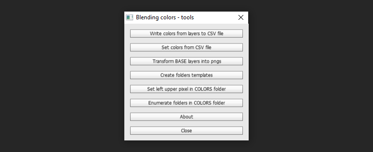

<h1 align="center">Blending PSD colors - toolset</h1>

🔎🔎🔎

 Read all colors in folder COLORS and save them into CSV file. It also has several others utility tools 

<i>
Important! Tested and created for Photshop CS6 64bit Version: 13.0 on Windows 10  
</i>

|      Write colors from layers to CSV file           |            Set colors from CSV file           |        Transform BASE layers into pngs           |     Set left upper pixel in COLORS           |     Create folders templates COLORS           |
| :---------------------------------------: | :-------------------------------------------: | :-------------------------------------: | :-------------------------------------: | :-------------------------------------: |
|  |      | |  |  |

## Getting Started 💡

The tool is created for reading blending **"colors layers"** hex values above **"base layers"**  All read values are written into a CSV file in the same directory as opened PSD file and with the same name
To do that just click **Write colors from layers to CSV file** in the menu

There are other utility tools as well, like:
**Set colors from CSV file**, **Transform BASE layers into pngs**, **Create folders templates**, **Set left upper pixel in COLORS**

List of **errors** during usage is written in a file in **chosen CSV directory** with **CSV's name + prefix _errors.csv**

If you want to customize the tool towards your needs look at **config.ini** in the script directory

### Toolset consist of:

- **Write colors from layers to CSV file** (Read all colors in folder COLORS. Save them into CSV file)

- **Set colors from CSV file** (Set colors from chosen CSV file into COLORS folder's layers)

- **Transform BASE layers into pngs** (Print screen all layers in folder BASE and save them into pngs)

- **Create folders templates** (Create a template in opened PSD for the tool)

- **Set left upper pixel in COLORS** (Give each COLORS's layer a pixel which is needed to be able to read color value)

- **About** (mainly usage and author's info)

### AppData are in: <em>~/.../Blending PSD colors - toolset/</em>:
- **config.ini**
  - <em>FILE STRUCTURE (How the PSD has to be constructed)
    - color_folder_name = COLORS (Name of folder from which color hex values will be gathered)
    - folders_in_it = 1 (Names of folders, created in COLORS folder)
    - layers_in_it = R,G,B (Names of each layer in folder in COLORS folder)
    - base_folder_name = BASE (Name of folder from which will be layers saved to pngs)
  - COLORS RGB (colors which will be set to layers in template)
    - R_color = FF0000 
    - G_color = 00FF00 
    - B_color = 0000FF 
  - COLOR PICKER COORDS PIXEL FILL (Color picker coordinates needed in **Set left upper pixel in COLORS**)
    - R_coord = 180,175 
    - G_coord = 140,274 
    - B_coord = 178,249</em>

### Prerequisites 💪

To run this script, you need at least **Photoshop CS6 64bit Version: 13.0** other versions of PS are not tested

### Installing 🔨

1. **Download "Blending PSD colors - toolset"**

2. **Unzip file** in a preferred directory (suggested place is: _...\Adobe\Adobe Photoshop CS6 (64 Bit)\Presets\Scripts)

3. **Open "Photoshop"**

4. Push keys: **Alt+F9**

5. Chose **"Action"** tabbed panel in the left upper corner

6. (If it is not yet) **Disable "Button mode"** by clicking an icon in the right upper corner

7. "**Create new action**" (right bottom corner of Action window)

8. **Name script** (e. g. UI toolset), optionally assign a key to it (e. g. F12) or add color (e. g. "Green")

9. Click **"ok"**

10. Choose in upper main menu: **"File -> Scripts -> Browse..."**

11. **Navigate** to the unzipped folder directory

12. **Open "blending_PSD_colors_toolset.jsx"**

13. Click **"Close"** button in UI toolset

14. Click **"Stop\playing recording"** (small grey square in the left bottom corner)

15. Enable **"Button mode"** (right upper corner)

16. Now your script is **ready to use** (Click button with your newly created action)

17. **Enjoy!**

## Running the tests 🧪

For now, only manual testing is available. Use [**Adobe Phtoshop CS6 SDK Win**](http://download.macromedia.com/pub/developer/photoshop/sdk/adobe_photoshop_cs6_sdk_win.zip) to find bugs during running script

## Built With 🧰

- [**Visual Studio Code**](https://code.visualstudio.com)
- [**Adobe Phtoshop CS6 SDK Win**](http://download.macromedia.com/pub/developer/photoshop/sdk/adobe_photoshop_cs6_sdk_win.zip)
- [**ExtendScript Debugger Extension for Visual Studio Code**](https://marketplace.visualstudio.com/items?itemName=Adobe.extendscript-debug) (mainly or debugging)

## Needed documentation 📦

- [**Photoshop CS6 Scripting Guide.pdf**](https://www.adobe.com/content/dam/acom/en/devnet/photoshop/scripting/Photoshop-CS6-Scripting-Guide.pdf)
- [**JavaScript Tools Guide CS6**](https://github.com/1179432578/psd-tool/blob/master/JavaScript%20Tools%20Guide%20CS6.pdf)
- [**Photoshop CS6 JavaScript Ref.pdf**](https://www.adobe.com/content/dam/acom/en/devnet/photoshop/scripting/Photoshop-CS6-JavaScript-Ref.pdf)

## Contributing 📬

Please read [**CONTRIBUTING.md**](docs/CONTRIBUTING.md) for details on our code of conduct, and the process for submitting pull requests to us

## Authors 🎈

- **Karol Łukaszczyk** - _Initial work_ - [**Lukkar**](https://github.com/Lukkar90)

## License 📜

This project is licensed under the MIT License - see the [**LICENSE**](LICENSE) file for details

## Acknowledgments 👍

- _README-template.md, CONTRIBUTING-template.md_ by [**PurpleBooth**](https://gist.github.com/PurpleBooth)
